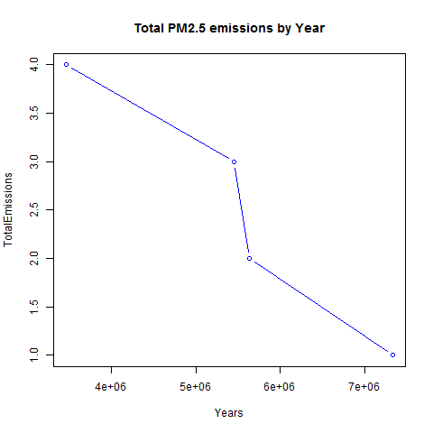
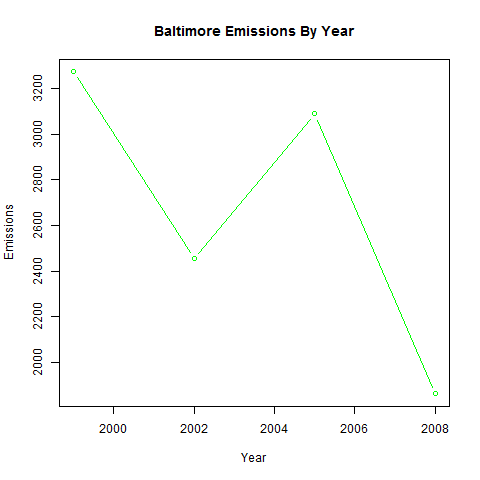
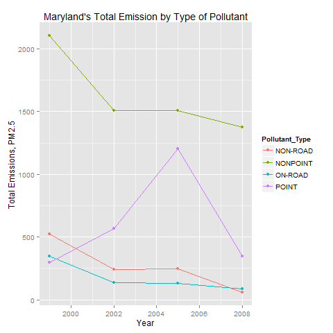
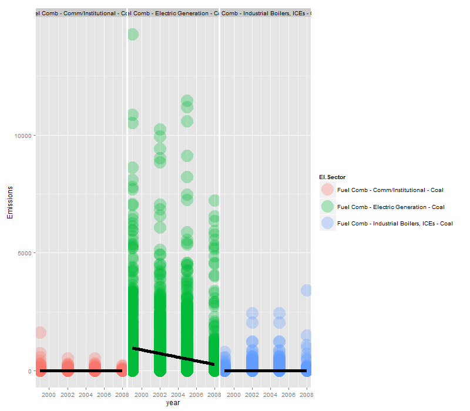
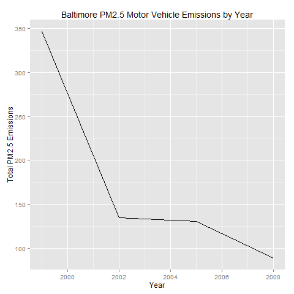
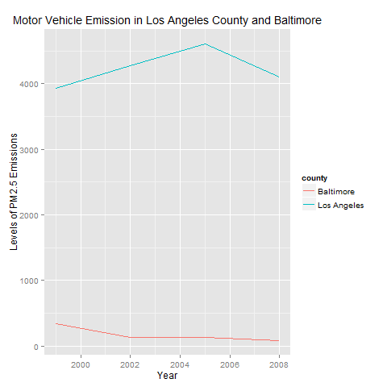

Exploratory Data Analysis - Course Project 2
============================================

# Introduction

Fine particulate matter (PM2.5) is an ambient air pollutant for which there is strong evidence that it is harmful to human health. In the United States, the Environmental Protection Agency (EPA) is tasked with setting national ambient air quality standards for fine PM and for tracking the emissions of this pollutant into the atmosphere. Approximatly every 3 years, the EPA releases its database on emissions of PM2.5. This database is known as the National Emissions Inventory (NEI). You can read more information about the NEI at the EPA National [Emissions Inventory web site](http://www.epa.gov/ttn/chief/eiinformation.html).

For each year and for each type of PM source, the NEI records how many tons of PM2.5 were emitted from that source over the course of the entire year. The data that you will use for this assignment are for 1999, 2002, 2005, and 2008.

**My Work and Answers of the Assignment**

### Question 1

Have total emissions from PM2.5 decreased in the United States from 1999 to 2008? Using the base plotting system, make a plot showing the total PM2.5 emission from all sources for each of the years 1999, 2002, 2005, and 2008.

**Answer 1:**

As we can see from the below plot, total emissions have decreased in the US from 1999 to 2008.

 

### Question 2

Have total emissions from PM2.5 decreased in the Baltimore City, Maryland (fips == "24510") from 1999 to 2008? Use the base plotting system to make a plot answering this question.

**Answer 2:**

Overall total emissions from PM2.5 have decreased in Baltimore City, Maryland from 1999 to 2008 as shown in the below plot.

 

### Question 3

Of the four types of sources indicated by the type (point, nonpoint, onroad, nonroad) variable, which of these four sources have seen decreases in emissions from 1999–2008 for Baltimore City? Which have seen increases in emissions from 1999–2008? Use the ggplot2 plotting system to make a plot answer this question

**Answer 3:**

The  non-road ,  nonpoint ,  on-road  source types have all seen decreased emissions overall from 1999-2008 in Baltimore City.

The  point  source saw a slight increase overall from 1999-2008. Also note that the  point  source saw a significant increase until 2005 and it decreases again by 2008 to little more than 1999.

 

### Question 4

Across the United States, how have emissions from coal combustion-related sources changed from 1999–2008?

**Answer 4:**

Emissions from coal combustion related sources have decreased by about 1/3 from 1999-2008.

 

### Question 5

How have emissions from motor vehicle sources changed from 1999–2008 in Baltimore City?

**Answer 5:**

Emissions from motor vehicle sources have dropped from 1999-2008 in Baltimore City.

 

### Question 6

Compare emissions from motor vehicle sources in Baltimore City with emissions from motor vehicle sources in Los Angeles County, California (fips == "06037"). Which city has seen greater changes over time in motor vehicle emissions?

**Answer 6:**

Los Angeles County has seen the greatest changes over time in motor vehicle emissions.

 

